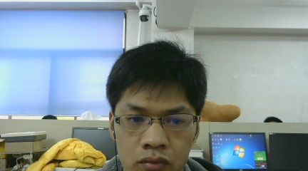
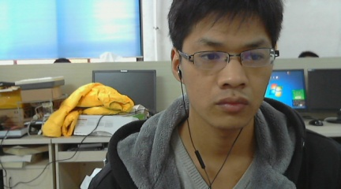

#imagehoint

###程序的说明:
>* 1.实现从摄像头实时采集单帧图像,之后完成图像的拼接,本程序实现了两张图片的拼接和三张图片的拼接
在此之前你需要在linux下安装opencv Package这个包,因为本程序主要使用opencv这个包中提供的api函数
实现从摄像头实时不同视角采集视频的单帧图像之后,完成图像的拼接,由于实验室设备有限,手头只有两个摄像头一次只能抓取
两张不同视角的单帧图像,我们抓取的单帧图像保存在当前项目目录下的frame1 和 frame2文件夹中,因此我同时制作了两个完成程序
拼接的程序,一个实现完成两个不同视角的图像拼接,另一个实现三张不同视角的单帧图像的拼接.
>* 2.其中的testusb.cpp文件是测试摄像头的程序.在执行本程序前,你应该保证有两个是摄像头插在主机端口上,用于实时采集单帧图像.

###代码介绍:
* 在进行程序的编译前,请确定你已经安装了opencv2.4.9,和pkg-config包,本程序是在ubuntu14.04平台下实现的,在本项目目录下,已经有编译生成的可执行程序,其中Camera\_to\_Frmae.cpp是我们从双摄像头实时抓取单帧图像的源码         
* ImageJoint.cpp和ImageJoint2.cpp,ImageJoint3.cpp分别是完成两张不同视角的
图像拼接和三张不同视角的图像拼接程序,其中三张图像拼接的图像是我从网上找的现成的图像库
* testusb.cpp是我测试摄像头的程序.        

###程序编译:
* g++   -o   dst   src.cpp  \`pkg-config opencv --cflags --libs\` 

###程序的执行:
* ./dst

###效果

**从摄像头设备采集两张单帧图像:**

**图像拼接效果图:**

